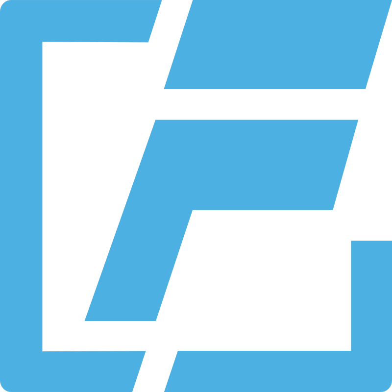
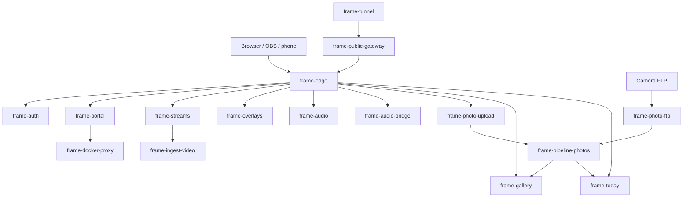

# FRAME

<p align="center">
  
</p>

FRAME is a modular, Docker-based streaming appliance for IRL and live production workflows.
The official project name is FRAME; the full styled name is Syronius' F.R.A.M.E.

This repository is the platform stack: a shared portal, routing edge, video relay, OBS overlays,
photo upload and gallery tools, Photo Stage controls, audio tools, and optional Discord audio
bridge. Each service has its own README under `services/` for deeper setup and operating details.

Current release target: `v1.0.0-Alpha`.

## Get The Code

From GitHub, open **Code** and choose **Download ZIP**, or use this direct link:

https://github.com/gall-levi-code/Syronius_FRAME/archive/refs/heads/main.zip

Extract the ZIP somewhere with a simple path, for example:

```text
C:\FRAME\Syronius_FRAME
```

## Requirements

FRAME runs through Docker Compose.

- Install Docker Desktop for Windows: https://www.docker.com/get-started/
- Docker Compose v2 is included with Docker Desktop.
- Docker's Compose install notes are here: https://docs.docker.com/compose/install/

After installing Docker Desktop, open PowerShell and check:

```powershell
docker --version
docker compose version
```

Linux and macOS use the same command center through `./stack.sh`; the walkthrough below is
Windows-first because double-clicking `stack.cmd` is the easiest path for most FRAME users.

## Quick Start On Windows

Open the extracted FRAME folder in File Explorer, then double-click:

```text
stack.cmd
```

FRAME opens a Command Prompt menu with numbered options.

For a first install:

1. Choose **Guided setup**.
2. Use the default LAN/local settings unless you already know you need something else.
3. When asked which services to enable, turn on:
   - Video Relay
   - Overlays
   - Browser Photo Upload
   - Photo Gallery
   - Photo Stage
4. Leave the other optional services disabled for now.
5. Let the installer validate and verify the setup.
6. When it offers to reconcile the Docker Compose stack, choose yes.

If you return to the main menu before starting containers, choose **Start or update stack**.

Open the Portal:

```text
http://localhost/dashboard
```

Useful first pages:

- Portal: `http://localhost/dashboard`
- Stream Management: `http://localhost/slsui`
- Stream Statistics: `http://localhost/stats/<stream-id>`
- Overlay Wizard: `http://localhost/overlays/setup`
- Browser Photo Upload: `http://localhost/photos/upload`
- Photo Gallery: `http://localhost/today/gallery`
- OBS Photo Stage Viewer: `http://localhost/today/viewer`
- Phone Photo Stage Remote: `http://localhost/today/remote`

Check status or logs:

- Choose **Status and logs** from the menu.

Stop the stack:

- Choose **Stop stack** from the menu.

On Linux/macOS, run `chmod +x stack.sh` once, then run `./stack.sh` without arguments to open the
same menu.

## Optional Setup

Set a shared Portal login for protected tools:

- Open `stack.cmd`.
- Choose **Credentials and security**.
- Set the Portal username and password.

Use a host-visible data path for StreamerBot `.ready` watchers:

- Open `stack.cmd`.
- Choose **Configure network/storage**.
- Set the host data root to the Windows path that backs FRAME's `data` folder.

Then watch:

```text
<host-data-root>\galleries
```

Include subfolders and process only files whose names end exactly in `.ready`.

Photo Upload defaults to 10 selected files and 10 concurrent upload sessions. Tune
`PHOTO_UPLOAD_MAX_FILES` and `PHOTO_UPLOAD_MAX_SESSIONS` from Advanced setup or `.env`.
Photo FTP passwords default to a 5-character minimum through `PHOTO_FTP_MIN_PASSWORD_LENGTH`.

Run verification:

- Choose **Validate and verify** from the menu.

## Native Setup App

The native [`apps/frame-setup`](apps/frame-setup) prototype explores the GUI-first installer path.
It uses the FRAME theme, offers Quick Start, Guided Setup, and Advanced flows, detects Docker
readiness and previous installs, plans host storage, checks exposed ports, and opens the local
`/setup` handoff.

For development:

```powershell
npm run setup:dev
```

## What Is Included

Start with the service README when you want to understand, operate, or customize a part of FRAME.

| Area | Service |
| --- | --- |
| Native setup prototype | [`apps/frame-setup/`](apps/frame-setup/README.md) |
| Routing | [`services/frame-edge/`](services/frame-edge/README.md) |
| Shared login | [`services/frame-auth/`](services/frame-auth/README.md) |
| Portal and status | [`services/frame-portal/`](services/frame-portal/README.md) |
| Hybrid tunnel notes | [`services/frame-tunnel/`](services/frame-tunnel/README.md) |
| Video relay wrapper | [`services/frame-ingest-video/`](services/frame-ingest-video/README.md) |
| Stream management | [`services/frame-streams/`](services/frame-streams/README.md) |
| OBS overlays | [`services/frame-overlays/`](services/frame-overlays/README.md) |
| Browser photo upload | [`services/frame-photo-upload/`](services/frame-photo-upload/README.md) |
| Camera FTP upload | [`services/frame-photo-ftp/`](services/frame-photo-ftp/README.md) |
| Photo processing | [`services/frame-pipeline-photos/`](services/frame-pipeline-photos/README.md) |
| Gallery | [`services/frame-gallery/`](services/frame-gallery/README.md) |
| Photo Stage viewer and remote | [`services/frame-today/`](services/frame-today/README.md) |
| Audio monitor | [`services/frame-audio/`](services/frame-audio/README.md) |
| Discord audio bridge | [`services/frame-audio-bridge/`](services/frame-audio-bridge/README.md) |

## Container Breakdown

FRAME separates the platform containers that make the stack work from the service containers that
provide optional tools. The installer turns service containers on and off from your selected
capabilities; core containers stay in place so routing, login, status, and shared storage keep
working.



**Core containers**

| Container | When It Runs | What It Does |
| --- | --- | --- |
| `frame-edge` | Always | Main local web entry point for FRAME pages. |
| `frame-auth` | Always | Shared login screen and protected-page session checks. |
| `frame-portal` | Always | Dashboard, navigation, status, and logs. |
| `frame-docker-proxy` | Always | Restricted Docker status access for Portal and Edge. |
| `frame-public-gateway` | Hybrid only | Filters which HTTP routes are allowed through the public tunnel. |
| `frame-tunnel` | Hybrid only | Cloudflare Tunnel connection for approved public web routes. |

**Service containers**

| Container | Enabled By | What It Does |
| --- | --- | --- |
| `frame-ingest-video` | Video Relay | SRTLA/SRT ingest and stream statistics. |
| `frame-streams` | Video Relay or Overlays | Stream profile management and `/stats` routing. |
| `frame-overlays` | Overlays | OBS overlay sources and the Overlay Wizard. |
| `frame-audio` | Audio Monitor | Browser capture, audio relay, listen pages, and HLS output. |
| `frame-audio-bridge` | Discord Audio Bridge | Discord voice audio, OBS mixes, speaking overlay, and controls. |
| `frame-photo-upload` | Browser Photo Upload | Protected browser/phone upload page. |
| `frame-photo-ftp` | Photo FTP Ingest | Camera FTP upload intake. |
| `frame-pipeline-photos` | Any photo feature | Photo validation, conversion, sidecars, `.ready` files, and archive output. |
| `frame-gallery` | Photo Gallery | Gallery pages and thumbnail cache. |
| `frame-today` | Photo Stage | Current-day viewer, remote, and dashboard controls. |

The canonical spec is [`docs/spec/v1.1.md`](docs/spec/v1.1.md). Installer details live in
[`installer/README.md`](installer/README.md).

## Current TODO

The public-facing backlog for the alpha release line:

**Overlay System**

- Add FTP/BELABOX upload-progress adapters and photo-pipeline correlation.
- Add latest-photo overlay and Photo Stage integration.

**Audio Monitor**

- Add relay retention controls and long-session soak tests.
- Remember recently seen browser audio devices so users do not have to refresh or reselect as often.

**Installer / Platform**

- Add host-port conflict preflight detection.
- Add LAN HTTPS and optional Cloudflare Access policy automation.
- Define cross-platform external data-root mounting and reset boundaries.

**Photo Workflow**

- Build the Discord delivery outbox.
- Add archive retention controls and disk-pressure policy.
- Add reliable HEIC decoding when the production image runtime supports it.
- Add camera and long-running FTP soak tests.

The fuller engineering backlog remains in [`docs/TODO.md`](docs/TODO.md).

## License

FRAME is released under the MIT License. See
[`LICENSE`](https://github.com/gall-levi-code/Syronius_FRAME/blob/main/LICENSE).
